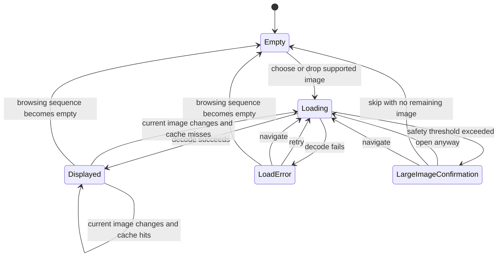

# Flick UX/UI Specification

Status: ready-for-tickets

## Outcome

Flick should feel like a focused, technically confident desktop utility: immediate, compact, and
native, with the current image occupying nearly the entire window. DuckStation and PCSX2 inform the
separation between content, on-screen feedback, and dense settings, but Flick does not inherit their
library, toolbar, or emulator-specific application shell.

The primary quality is continuity of viewing. Opening an image, moving through a browsing sequence,
and inspecting pixels should feel direct and should not reveal interface machinery unless the user
asks for it or needs feedback.

## Product Invariants

- Flick has no editing workflow and never changes source files.
- There is one viewing workflow, not separate library and viewer modes.
- The current image receives the maximum practical window area.
- Core viewing remains keyboard accessible.
- Browsing remains available during loading failures and large-image confirmation.
- The application remains offline and does not expose recent-file history.
- Linux and macOS share behavior but retain platform conventions.

## Information Architecture

### Window

The normal window contains one viewing surface. It has no permanent toolbar, sidebar, status bar,
or navigation controls. System window decoration remains present outside fullscreen.

Commands are exposed through three command surfaces:

1. Keyboard shortcuts are the fastest path.
2. The viewing-surface context menu is the complete nearby path.
3. The platform application menu exposes conventional Open, View, Image, Help, and Settings entry
   points.

### Presentation state map

Only one presentation state occupies the viewing surface at a time. The browsing sequence is owned
outside presentation and remains operable wherever a current image path exists.

## Presentation States

### Empty

Centered content contains the Flick mark, **Open an image**, a **Choose file** action, and the text
**or drop it here**. A compact teaching line reads `← → Browse · Wheel Navigate · Right-click
Commands`. Empty is an invitation, not a library or home screen, and contains no recent files.

### Loading

The first request shows a quiet centered progress indicator and filename. During navigation, remove
the preceding image immediately so it cannot be mistaken for the new current image. Delay the
indicator by approximately 120 ms so cache hits and fast decodes do not flash loading chrome.

### Displayed

The image is centered using the existing fit-or-100% policy. No persistent controls surround it.
Zoom, pan, rotation, animation, and display conversion remain view state and reset or persist
according to the MVP specification.

### Load error

Show a centered in-surface card with a plain-language explanation, primary **Retry**, secondary
**Details**, and a hint that left and right navigation remains available. Details expand in place.
Do not open a modal error dialog.

### Large-image confirmation

Show a centered in-surface card containing declared dimensions, estimated decoded memory, primary
**Open anyway**, and secondary **Skip**. Navigation remains available. `Esc` chooses Skip. Do not
present the warning as an application or system failure.

### Drop target

While a valid drag is over the window, add a thin accent border to the viewing surface and center
**Drop to open**. For a supported explicit list, show **Drop to browse N images**. Leaving or
cancelling the drag restores the prior state without changing the current image.

## Status Overlay

The single non-interactive status overlay sits centered near the bottom safe edge of the viewing
surface. Its normal content is:

`filename.jpg    12 / 84    67%`

It appears after open, navigation, zoom, rotation, and pointer movement, then fades away. Short
feedback such as a sequence boundary or successful copy temporarily replaces the normal content in
the same overlay. Do not introduce a separate toast system.

Use a dark, nearly opaque fallback surface with light text so contrast is independent of image
content. A restrained blur may enhance the surface only where reliable and inexpensive. The overlay
must remain legible without blur.

## Command Behavior

### Context menu

Organize viewing actions into five short groups:

1. Open
2. View: Fit, 100%, zoom, fullscreen
3. Image: rotation, animation pause/resume, information
4. Copy & Reveal
5. Preferences

Unavailable commands stay visible and disabled. Previous and Next are taught through shortcuts and
are not repeated as menu rows. **Quit Flick** follows as the final context-menu command, separated
from Preferences, and invokes the same application action exposed by the File menu.

### Focus and Escape

The viewing surface receives focus after opening and after a dialog closes. Viewing shortcuts do not
depend on pointer position. Dialogs keep normal platform focus order and consume their own input.
Do not draw a focus ring around non-interactive image content.

`Esc` resolves the highest active layer in this order: close a menu or dialog; skip large-image
confirmation; leave fullscreen; otherwise do nothing. It never closes Flick or clears the current
image.

### Fullscreen

Fullscreen contains the same viewing surface and no control bar. Pointer motion reveals the status
overlay. On first entry, briefly teach **F11 or Esc to exit fullscreen**. The context menu remains
available.

## Dialogs

### Settings

Use a compact native dialog with three groups:

- Navigation: primary wheel action.
- Appearance: viewing-surface background and status-overlay visibility.
- Performance & Window: decoded cache budget and geometry restoration.

Changes preview immediately to preserve the existing settings contract. **Apply** commits the
preview; **Cancel** restores the values from dialog opening; **Reset Defaults** previews defaults.
The number of settings does not justify category navigation or a sidebar.

### Image Information

Use a compact, non-modal floating dialog. It remains open during navigation and updates for the new
current image. It presents path, format, dimensions, byte size, modification time, zoom, rotation,
animation state, and browsing-sequence position. It must not permanently reduce image area.

File selection and color selection continue to use platform-native dialogs.

## First-use Teaching

The empty-state teaching line remains available whenever empty. On the first displayed image, show
one transient hint for browsing and the context menu. Consider the workflow learned after the user
navigates or opens the context menu, and persist that local flag. Do not add an onboarding wizard.

## Visual System

- Follow the system theme for menus, dialogs, focus, and conventional controls.
- Give the viewing surface an independent default background of `#181A1B`.
- Use the platform accent color for focus, primary actions, selected values, and drop feedback.
- Use the system UI typeface and native text metrics.
- Base spacing on a 4 px unit, with 8 px as the normal adjacent-control gap.
- Use approximately 6 px corner radii only for overlays and in-surface cards.
- Avoid gradients, decorative panels, and permanent chrome around the image.
- Use icons only to accelerate recognition; accompany them with labels in menus and dialogs.
- Show the Flick mark only in Empty and About, never over a displayed image.

Exact token values beyond these anchors must be evaluated visually in the prototype rather than
treated as implementation constants now.

## Motion

- Fade the status overlay over 140–180 ms.
- Ordinary browsing transitions do not fade or slide the image, including the Loading-to-Displayed
  path.
- Optional short opacity reveals are limited to independently entered in-surface cards and
  transient feedback; they never delay or hide a state change.
- Zoom and pan follow input directly without decorative easing.
- Disable optional opacity transitions when the platform requests reduced motion.

## Platform Adaptation

macOS uses Command shortcuts, its global application menu, native button ordering, and standard
window behavior. Linux uses Control shortcuts, the desktop theme, and its conventional context and
application menus. Viewing surface geometry and presentation-state meaning remain common. Visual
pixel parity between platforms is explicitly not a goal.

## Accessibility

- Every core command has a keyboard path.
- Interactive elements expose accessible names and descriptions.
- Disabled commands remain discoverable in command surfaces.
- Text and focus indicators use system palette roles wherever they are not image-overlay content.
- Overlay and card contrast may not depend on blur or image sampling.
- High-DPI layouts must avoid clipped labels and unreachable dialog actions.
- Motion is supplementary and never the only representation of state change.

## Prototype Questions

The prototype must answer these visual questions before production implementation:

1. Do Empty, Load error, and Large-image confirmation feel like one coherent state family?
2. Is the status overlay readable without becoming the dominant element?
3. Are all essential actions discoverable without a toolbar?
4. Does the context menu remain scannable with all existing actions?
5. Do Settings fit comfortably at minimum supported scale and window size?
6. Does the non-modal Image Information dialog help comparison without obscuring the image?
7. Are the 120 ms loading threshold and overlay fade free from distracting flashes?
8. Does drag feedback remain clear over both very dark and very bright images?

## Prototype Decision

The selected visual direction is Variant A's centered native composition for the window,
presentation-state family, command surfaces, Settings, and Image Information. In the Displayed
state, use Variant C's quieter pill-shaped status overlay, centered near the bottom safe edge. This
combination preserves the compact native-utility character while giving transient image status a
more distinct overlay treatment without adding permanent chrome.

Variants B and C are not implementation targets beyond the selected status-overlay treatment.
Timing, native menu placement at screen edges, and high-DPI density remain production-validation
questions rather than reasons to reopen the selected hierarchy.

## Prototype Acceptance

- Represent every presentation state at 480×320 and a typical desktop window size.
- Demonstrate normal, fullscreen, context-menu, Settings, and Image Information flows.
- Include light and dark system-chrome variants around the fixed viewing-surface background.
- Exercise keyboard focus, Escape precedence, reduced motion, and long filenames.
- Keep the prototype throwaway and separate from production source.
- Capture decisions that survive evaluation back into this specification before tickets are made.

## Out of Scope

- A library, thumbnail grid, file browser, recent files, sidebar, or permanent toolbar.
- Editing, file management, metadata editing, or export workflows.
- Custom replacement of platform-native file and color dialogs.
- A TV, controller-first, or touch-first interface.
- Exact reproduction of DuckStation or PCSX2 styling.
- Production refactoring or implementation during the prototype phase.

## References

- Product behavior: `../flick/spec.md`
- Domain language: `../../CONTEXT.md`
- Presentation boundary: `../../docs/adr/0001-deepen-image-lifecycle.md`
- Content-first decision: `../../docs/adr/0002-content-first-presentation.md`
- Current UI implementation: `../../src/main.cpp`
