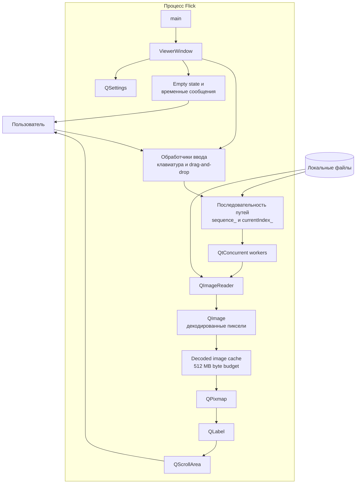
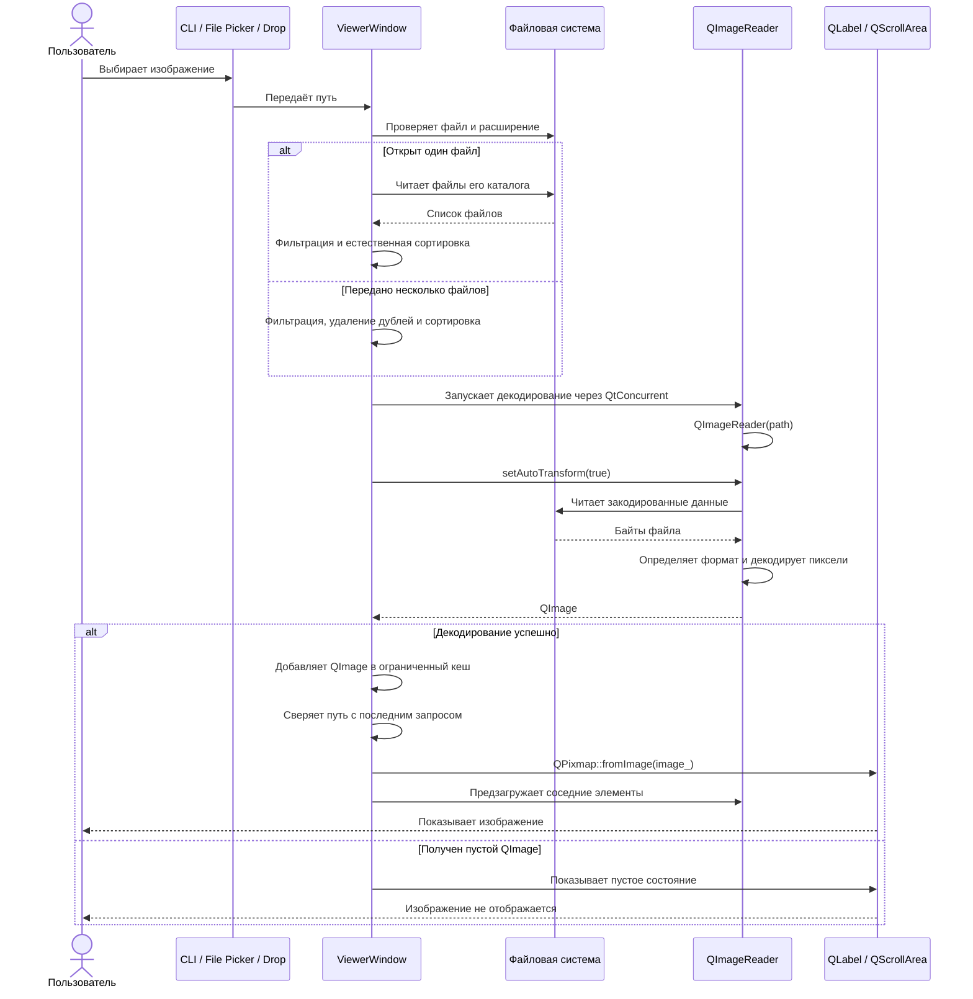
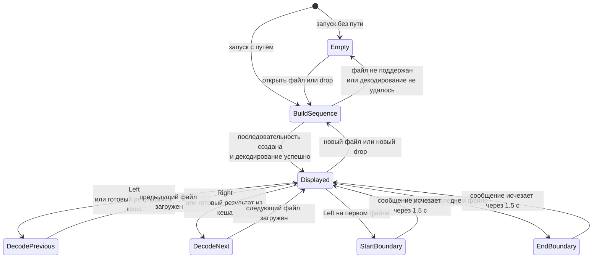

# Архитектура Flick

Документ описывает текущую архитектуру приложения. Flick пока представляет собой
небольшое Qt-приложение, основная логика которого сосредоточена в `src/main.cpp`.

## Компоненты приложения

`ViewerWindow` одновременно отвечает за интерфейс, построение списка файлов,
навигацию и загрузку изображения. Отдельного слоя модели или сервиса
декодирования в текущей версии нет.

## Открытие и декодирование изображения

`QImageReader::read()` выполняется в пуле рабочих потоков через `QtConcurrent`.
GUI-поток принимает только готовый `QImage`, сверяет его путь с последним
запрошенным элементом и поэтому игнорирует устаревшие результаты. Предыдущий и
следующий элементы предзагружаются. Декодированные изображения хранятся в кеше
с LRU-вытеснением и бюджетом около 512 МБ.

## Навигация по изображениям

Список хранится в `sequence_`, а выбранная позиция — в `currentIndex_`.
Переход к соседнему элементу повторно вызывает синхронное декодирование.

## Архитектура тестирования

Тесты работают через границу настоящего приложения: запускают бинарник в
режиме `offscreen`, имитируют пользовательские события и проверяют итоговый
снимок окна. Тестовый канал команд и создание снимков включаются только при
определении `FLICK_ENABLE_TEST_HARNESS`.
