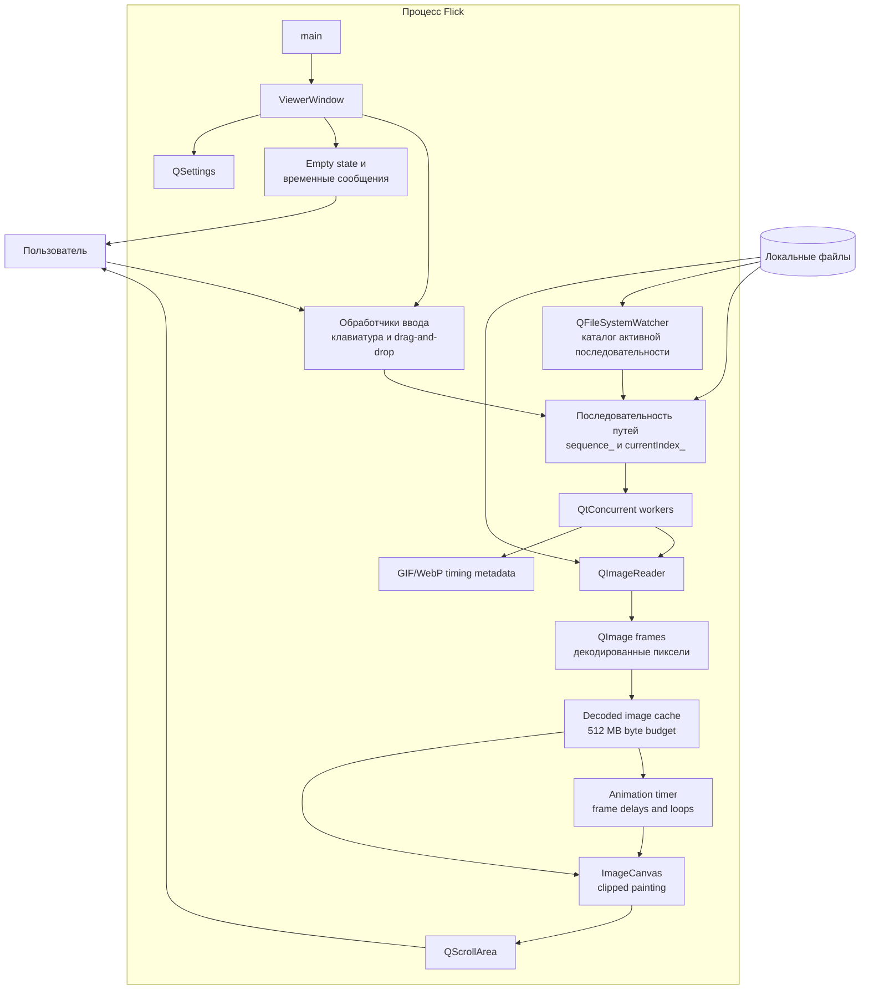
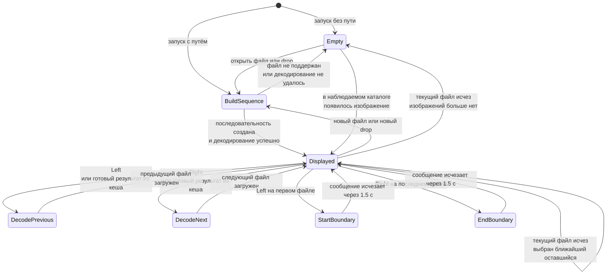
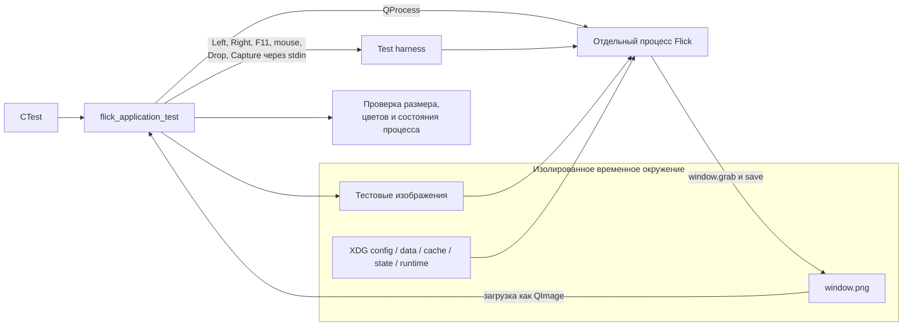

# Архитектура Flick

Документ описывает текущую архитектуру приложения. Flick пока представляет собой
небольшое Qt-приложение, основная логика которого сосредоточена в `src/main.cpp`.

## Компоненты приложения

`ViewerWindow` одновременно отвечает за интерфейс, построение списка файлов,
навигацию и загрузку изображения. Отдельного слоя модели или сервиса
декодирования в текущей версии нет.

Для последовательности, открытой из одного файла, `QFileSystemWatcher` следит
за содержащим его каталогом. При изменении каталога `ViewerWindow` повторно
фильтрует и естественно сортирует поддерживаемые видимые файлы. Явная
последовательность из нескольких переданных путей не регистрирует каталог в
наблюдателе и поэтому не расширяется внешними добавлениями.

## Открытие и декодирование изображения

`QImageReader::read()` выполняется в пуле рабочих потоков через `QtConcurrent`.
GUI-поток принимает только готовый `QImage`, сверяет его путь с последним
запрошенным элементом и поэтому игнорирует устаревшие результаты. Предыдущий и
следующий элементы предзагружаются. Декодированные изображения хранятся в кеше
с LRU-вытеснением и бюджетом около 512 МБ.

Перед чтением пикселей рабочая задача проверяет объявленные размеры изображения
и оценивает распакованный RGBA-буфер. При размере свыше 100 мегапикселей или
оценке свыше 1 ГБ задача возвращает запрос подтверждения, не начиная декодирование.
После подтверждения новая задача снова выполняет чтение в рабочем потоке. Ошибка
чтения показывает встроенное сообщение и раскрываемые технические подробности,
не меняя последовательность; `F5` повторяет текущий запрос.

Для GIF и WebP рабочий поток декодирует все кадры и читает из контейнера
длительности кадров и число повторов. GUI-поток переключает уже декодированные
кадры одноразовым `QTimer`, поэтому задержки и конечное либо бесконечное
зацикливание сохраняются. `Space` останавливает таймер с оставшейся задержкой и
запускает его снова; для статического изображения команда ничего не меняет.
`QImageReader::setAutoTransform(true)` применяет EXIF-ориентацию ко всем
декодированным кадрам.

При показе нового изображения `ViewerWindow` выбирает масштаб `min(100%,
fit-to-viewport)`. Масштаб хранится отдельно от декодированных кадров, поэтому
анимация сохраняет выбранный пользователем вид. По умолчанию колесо мыши
управляет последовательностью, а с зажатым `Ctrl` — масштабом; эти действия
можно поменять местами через контекстное меню области просмотра. Выбранное
основное действие сохраняется в `QSettings`. При масштабировании позиции полос
прокрутки пересчитываются так, чтобы точка изображения под указателем оставалась
на месте; перетаскивание левой кнопкой и `Shift` со стрелками изменяют те же
позиции. Обычные стрелки влево и вправо по-прежнему управляют
последовательностью и при смене изображения сбрасывают вид к начальному
масштабу.

`ImageCanvas` хранит исходный `QImage`, но не создаёт полный увеличенный
`QPixmap`. В `paintEvent` он сопоставляет видимую часть холста с соответствующим
прямоугольником исходных пикселей и масштабирует только этот фрагмент. Поэтому
память рендера определяется размером viewport, а не квадратом масштаба.

Клавиши `L` и `R` временно поворачивают уже автоматически ориентированный кадр
на 90 градусов влево или вправо перед масштабированием. Масштабирование,
вписывание и панорамирование используют размеры повернутого представления.
Поворот хранится только в `ViewerWindow`, сбрасывается при смене текущего
изображения и не записывает файл или его метаданные.

`F11` и двойной щелчок по области просмотра переключают полноэкранный режим,
а `Esc` возвращает обычное декорированное окно. Поверх изображения временно
показывается имя файла, позиция в последовательности и текущий масштаб.
Движение мыши снова показывает эту строку; после бездействия она исчезает, а
в полноэкранном режиме вместе с ней скрывается указатель. Скрытие указателя не
меняет фокус и не блокирует клавиатурные команды.

Диалог информации (`I`) строится из текущего пути, файловых метаданных,
декодированного изображения и состояния представления. Команды контекстного
меню передают абсолютный путь или временно повёрнутые отображаемые пиксели в
системный буфер обмена и просят `org.freedesktop.FileManager1` выделить файл;
исходный файл при этом не изменяется. Ошибки внешнего действия показываются тем же
временным каналом обратной связи и не завершают процесс Flick.

## Навигация по изображениям

Список хранится в `sequence_`, а выбранная позиция — в `currentIndex_`.
При внешнем удалении или переименовании текущего файла выбирается элемент с той
же позицией в обновлённой сортировке, а если такого нет — предыдущий. Пользователь
получает краткое уведомление. Пустой обновлённый каталог переводит окно в
нейтральное пустое состояние; наблюдение продолжается, поэтому новое
поддерживаемое изображение снова становится текущим.

## Архитектура тестирования

Тесты работают через границу настоящего приложения: запускают бинарник в
режиме `offscreen`, имитируют пользовательские события и проверяют итоговый
снимок окна. Тестовый канал команд и создание снимков включаются только при
определении `FLICK_ENABLE_TEST_HARNESS`.
