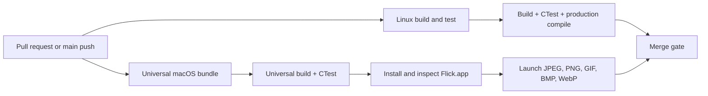
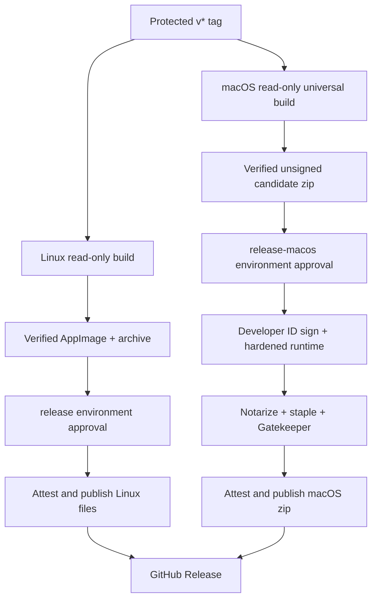

# Continuous integration

Flick uses GitHub Actions for pull-request validation, tagged x86_64 Linux
releases, and universal macOS releases.

## Required checks

`.github/workflows/ci.yml` runs for pull requests, pushes to `main`, and manual
dispatches. It:

1. validates workflow syntax and the repository's workflow contract;
2. installs Qt 6.5 and the Linux build dependencies;
3. builds the instrumented driver with `BUILD_TESTING=ON`;
4. runs the complete CTest suite;
5. independently builds the non-instrumented production target with
   `BUILD_TESTING=OFF`.

The `main` branch protection in GitHub requires a pull request and the
`Linux build and test` status check. It also requires the branch to be current,
linear history and resolved conversations, and blocks force pushes and
deletion. The workflow itself has only `contents: read` permission.

GitHub-hosted runners need no repository secrets for CI.



`.github/workflows/ci-macos.yml` runs alongside Linux CI on pull requests,
pushes to `main`, and manual dispatches. On `macos-14` it installs Qt 6.5 with
the image-format plugins, builds and tests a macOS 13 universal
`arm64;x86_64` target, installs `Flick.app`, and verifies:

- bundle identifier, minimum OS, document types, and both architectures;
- bundled Qt frameworks, Cocoa platform plugin, and image plugins;
- absence of the test harness in the production executable;
- strict ad-hoc code-signature validity;
- installed-bundle startup for JPEG, PNG, GIF, BMP, and WebP fixtures.

The macOS job has only `contents: read` permission and receives no signing
credentials. Hosted CI proves compilation, deterministic behavior, packaging,
and startup; native Finder, Spaces, input-device, and calibrated-display checks
remain part of the retained real-device release evidence.

## Linux releases

The operator-facing procedure is in [`releasing.md`](releasing.md).

`.github/workflows/release-linux.yml` runs for tags matching `v*`. The tag must
match the CMake project version exactly; version `0.1.1` is released as
`v0.1.1`.

The release workflow repeats the complete tests, builds a clean production
binary, creates the AppImage and development archive, runs offline release
verification, writes `SHA256SUMS`, creates GitHub artifact attestations, retains
a short-lived workflow artifact, and publishes the files to a GitHub Release.
It uses the workflow-provided `GITHUB_TOKEN`; no personal access token is
required.

Build, test, and packaging run in a job restricted to `contents: read`. A
separate tag-only `publish` job downloads that job's immutable workflow
artifact and alone receives `contents: write`, `id-token: write`, and
`attestations: write`.

Before creating a tag:

```sh
git switch main
git pull --ff-only
git tag -s v0.1.1 -m "Flick 0.1.1"
git push origin v0.1.1
```

If signed tags are not yet configured, use an annotated tag and retain GitHub
branch/ruleset protection as the source-control gate.

Create a GitHub Environment named `release` and restrict it to protected tags.
Add required reviewers if releases should require a final human approval. The
environment contains no Linux secrets; it gates the privileged publish job.

The linuxdeploy and Qt plugin `continuous` assets are mutable upstream URLs.
Their currently reviewed bytes are pinned by SHA-256 in the release workflow.
When upstream rotates either asset, the release intentionally fails. Download
both assets, review the upstream changes, run the packaging flow locally, then
update both checksums in one pull request.

## Actions maintenance

Dependabot checks GitHub Actions weekly. Third-party actions are limited to the
Qt installer; GitHub-maintained checkout, artifact upload, and attestation
actions provide the remaining integrations. Review action upgrade notes before
merging Dependabot changes, especially minimum self-hosted runner versions.

`scripts/validate-github-actions.sh` downloads the fixed actionlint release,
verifies its checksum, checks every workflow, and then runs the semantic
workflow-contract test.

## Desktop release matrix

GitHub-hosted Ubuntu jobs prove build, tests, artifact contents, and offscreen
launch. They do not prove compositor integration. Before publishing a release,
run the matrix in `docs/performance-and-release.md` on real or self-hosted
Ubuntu, Fedora, and Arch machines under both Wayland and X11.

Recommended self-hosted labels are:

```text
self-hosted,linux,x64,ubuntu,wayland
self-hosted,linux,x64,ubuntu,x11
self-hosted,linux,x64,fedora,wayland
self-hosted,linux,x64,fedora,x11
self-hosted,linux,x64,arch,wayland
self-hosted,linux,x64,arch,x11
```

Keep those runners dedicated, ephemeral where possible, and do not attach them
to workflows triggered by untrusted fork code.

## macOS releases

`.github/workflows/release-macos.yml` runs for `v*` tags and manual dispatches.
Its read-only build job produces and verifies an ad-hoc-signed universal
candidate, then uploads that immutable zip. Manual dispatch stops there and
does not publish a user release.

For a tag, `sign-and-publish` downloads the same candidate and enters the
protected `release-macos` Environment. That environment must be created before
the first macOS release, restricted to protected `v*` tags, and configured with
required reviewers. It owns these secrets:

- `APPLE_DEVELOPER_ID_CERTIFICATE` — base64-encoded Developer ID `.p12`;
- `APPLE_CERTIFICATE_PASSWORD`;
- `APPLE_KEYCHAIN_PASSWORD`;
- `APPLE_DEVELOPER_IDENTITY`;
- `APP_STORE_CONNECT_ISSUER_ID`;
- `APP_STORE_CONNECT_KEY_ID`;
- `APP_STORE_CONNECT_PRIVATE_KEY`.

The privileged job imports the identity into a temporary keychain, signs all
nested code with the hardened runtime and secure timestamp, verifies the
signature, notarizes and staples the app, runs Gatekeeper assessment, creates
checksums and provenance attestations, and uploads only the verified artifact
to the GitHub Release. The temporary keychain is deleted even after failure.

At the time the `0.1.1` release branch was prepared, the repository exposed the
Linux `release` Environment but not `release-macos`. Pushing `v0.1.1` before
creating and populating `release-macos` will allow the unprivileged candidate
build to run, but the signed macOS publication job cannot complete.


